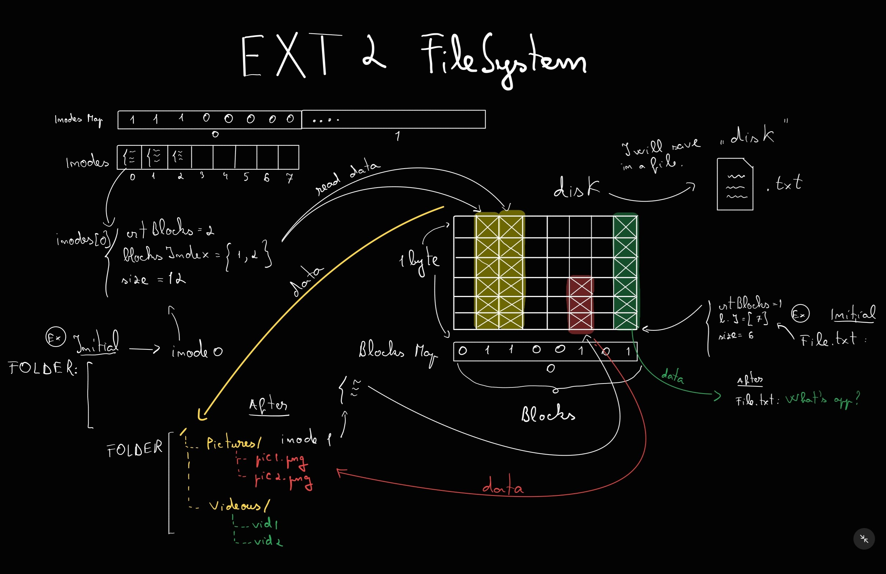

# FileSystem Project
This repository represents a simple simulation of a File System. It's a personal project for improving my knowledge and my skills in C language.

## About EXT2
Ext2 or Second Extended File System was the default file system for Linux kerner until supplanted by Ext3 in 2001.

Ext2 divides the disk into multiple block groups. Each block group contains:
- Superblock - stores metadata about filesystem (size, free blocks, inode count, etc.)
- Block Bitmap - keeps track about allocated/free blocks
- Inode Bitmap - keeps track about allocated/free inodes
- Inode Table - stores metadata about files/directories
- Data Blocks - store actual file content

## Operating Principle
Every structure mentioned above is read from disk. When a file or directory is created,it means that an entry in the directory will be created. An entry memorises the allocated inode and name of the file/folder.
- How can system keep content of a file?
Just puts the content in the blocks and memorises in which blocks is data.
- How many blocks can use a single file ?
Too much to fill them. The blocks are allocated while file data is increasing.
    - 12 blocks direct: keeps data
    - 1 indirect block: keeps pointers to another blocks of data
    - 1 double indirect block: keeps pointers to blocks with pointers to another blocks of data
    - 1 triple indirect block
So number is increasing very much.
- What is an inode ?
An inode keeps track of allocated blocks for that file/folder, the inode of directory where is kept the file/folder, permissions, timestamps.
When you do "ls <filename>", all data displayed is memorised by inode table.
- What about directories ?
Same principle as files, but in the blocks are memorised the entries(names and inodes index).

## Commands
  COMMAND ------------------------>  ACTION 
- mkdir <path/directory_name>         create new directory
- touch <path/file_name>              create new file
- echo <content> >/>> <path_to_file>  add content to a file
- rm <path_to_file>                   remove a file
- rmdir <path_to_directory>           remove an empty directory
- cd <path_to_directory>              change current location
- ls <path_to_directory>              list entries of directory
- pwd                                 show path from root to current directory
- cat <path_to_file>                  show content of file

## Running
just do :
`gcc main.c -o main`
and :
`./main`
